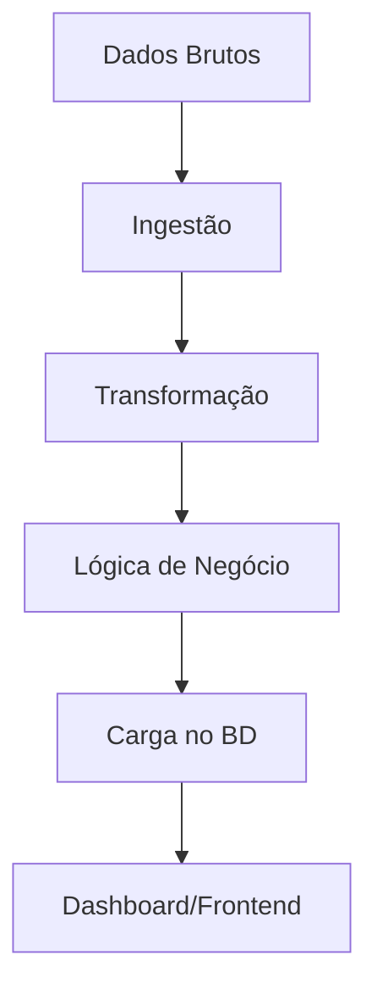

# APS Hackathon Premiersoft 2025

Sistema de gestão e análise de dados para saúde pública, com dashboard interativo, ingestão de dados, alocação inteligente de recursos e consulta de entidades.

## 📜 Tabela de Conteúdos

- [📂 Estrutura do Projeto](#-estrutura-do-projeto)
- [🚀 Como Rodar o Projeto](#-como-rodar-o-projeto)
- [📊 Funcionalidades](#-funcionalidades)
- [🏛️ Arquitetura da Solução](#️-arquitetura-da-solução)
- [🛠️ Requisitos](#️-requisitos)
- [📌 Observações](#-observações)
- [✍️ Autores](#️-autores)

## 📂 Estrutura do Projeto

A estrutura de pastas foi organizada para separar as responsabilidades e facilitar a manutenção:

```
├── data/                  # Dados brutos e scripts de inicialização
├── scripts/               # Scripts SQL para inicialização do banco
├── src/
│   ├── dashboard/         # Interface do dashboard principal
│   │   ├── __init__.py
│   │   └── app.py
│   ├── frontend/          # Interface web (Streamlit)
│   │   ├── .streamlit/    # Configurações do Streamlit
│   │   ├── assets/        # Assets estáticos (CSS, JS, imagens)
│   │   ├── app.py         # Aplicação principal do Streamlit
│   │   └── db_utils.py    # Utilitários de conexão com banco
│   ├── ingestion/         # Conversores para múltiplos formatos
│   │   └── converter.py   # Conversores (CSV, XML, HL7)
│   └── pipeline/          # Orquestração do ETL
│       ├── __init__.py
│       ├── allocate.py    # Algoritmos de alocação inteligente
│       ├── extract.py     # Extração de dados
│       └── extract_utils.py # Utilitários de extração
├── docker-compose.yml     # Orquestração de containers
└── requirements.txt       # Dependências Python
```

## 🚀 Como Rodar o Projeto

Siga os passos abaixo para executar a aplicação em seu ambiente local.

### Pré-requisitos

- Docker
- Docker Compose
- Python 3.11+

### 1. Clone o Repositório

```bash
git clone <URL_DO_SEU_REPOSITORIO>
cd <NOME_DO_SEU_REPOSITORIO>
```

### 2. Suba os Serviços com Docker Compose

Este comando irá construir as imagens, iniciar o banco de dados, executar o pipeline de ETL e subir a aplicação web:

```bash
docker-compose up --build
```

Alternativamente, você pode executar os serviços passo a passo:

```bash
# Constrói as imagens
docker-compose build

# Inicia apenas o banco de dados em background
docker-compose up -d db

# Executa o pipeline de ETL para popular o banco
docker-compose run pipeline

# Inicia todos os serviços (incluindo o frontend)
docker-compose up
```

### 3. Instale as Dependências (execução local sem Docker)

Caso prefira executar o frontend fora do container, certifique-se de que o banco de dados esteja rodando via Docker e instale as dependências:

```bash
pip install -r requirements.txt
```

### 4. Execute o Frontend (execução local sem Docker)

Com as dependências instaladas, inicie a interface Streamlit:

```bash
# Para o dashboard principal
streamlit run src/dashboard/app.py

# OU para o frontend web
streamlit run src/frontend/app.py
```

A aplicação estará disponível em **http://localhost:8501**.

## 📊 Funcionalidades

### 🎯 Dashboard Interativo
Visualização dos principais indicadores de saúde, como:
- Ocupação de leitos
- Distribuição de profissionais
- Estatísticas epidemiológicas
- Métricas em tempo real

### 📥 Ingestão de Dados
Sistema de upload robusto que aceita diversos formatos:
- **Excel** (.xlsx, .xls)
- **CSV** (.csv)
- **XML** (.xml)
- **JSON** (.json)
- **HL7** (padrão de saúde)

### 🧠 Alocação Inteligente
Algoritmos para otimizar a alocação de recursos:
- Distribuição de médicos por especialidade
- Alocação de pacientes por proximidade
- Otimização baseada em capacidade hospitalar
- Sugestões de melhor combinação geográfica

### 🔍 Consulta de Entidades
Interface completa para gerenciamento:
- Busca avançada por filtros
- Navegação por hospitais, médicos e pacientes
- Visualização de dados consolidados
- Exportação de relatórios

## 🏛️ Arquitetura da Solução

O sistema foi desenhado com uma clara separação de responsabilidades entre as camadas, seguindo os princípios de clean architecture e facilitando a manutenção e escalabilidade.

### 📊 Fluxo de Dados (Pipeline ETL)



#### 1. **Ingestão** (`/src/ingestion/`)
- Leitura de arquivos múltiplos formatos (.csv, .xlsx, .hl7, etc.)
- Conversão para schema padronizado (DataFrame Pandas)
- Uso de SCHEMA_MAP universal para tradução de colunas

#### 2. **Transformação** (`/src/pipeline/extract.py` e `extract_utils.py`)
- **Limpeza**: Tratamento de valores nulos e formatos inconsistentes
- **Validação**: Verificação de tipos de dados (ex: leitos_totais → inteiro)
- **Deduplicação**: Remoção de registros duplicados (ex: CPF de pacientes)
- **Enriquecimento**: Adição de coordenadas geográficas

#### 3. **Lógica de Negócio** (`/src/pipeline/allocate.py`)
- Funções "puras" para regras de alocação
- Algoritmos de otimização de recursos
- Cálculos de proximidade geográfica
- Retorno de resultados como DataFrames processados

#### 4. **Carga** (Pipeline de Load)
- Persistência no PostgreSQL
- Respeito à ordem de dependência das tabelas
- Garantia de integridade referencial

#### 5. **Visualização** (`/src/frontend/` e `/src/dashboard/`)
- Dashboard Streamlit com dados consolidados
- Leitura direta do banco de dados
- KPIs e gráficos interativos

## 🛠️ Requisitos

### Tecnologias Principais
- **Linguagem**: Python 3.11+
- **Processamento**: Pandas, NumPy
- **Banco de Dados**: PostgreSQL + PostGIS
- **Interface**: Streamlit
- **Containerização**: Docker & Docker Compose

### Bibliotecas Essenciais
```
streamlit
pandas
sqlalchemy
psycopg2-binary
python-hl7
geopandas
plotly
```

## 📌 Observações

- 📁 **Dados de exemplo** para teste estão na pasta `data/raw/`
- 🗃️ **Inicialização do BD** via script `scripts/init.sql`
- 🎨 **Configurações do Streamlit** na pasta `src/frontend/.streamlit/`
- 🐳 **Ambiente containerizado** para fácil deploy e reprodução
- 🔄 **Pipeline automatizado** de ETL com validação de dados
- 📈 **Dashboards responsivos** com visualizações interativas

## ✍️ Autores

Projeto desenvolvido para o **APS Hackathon Premiersoft 2025**, com fins educacionais e de inovação em saúde pública.

---

### 🏆 Hackathon Premiersoft 2025
*Sistema inteligente para gestão de saúde pública com foco em otimização de recursos e análise de dados epidemiológicos.*
